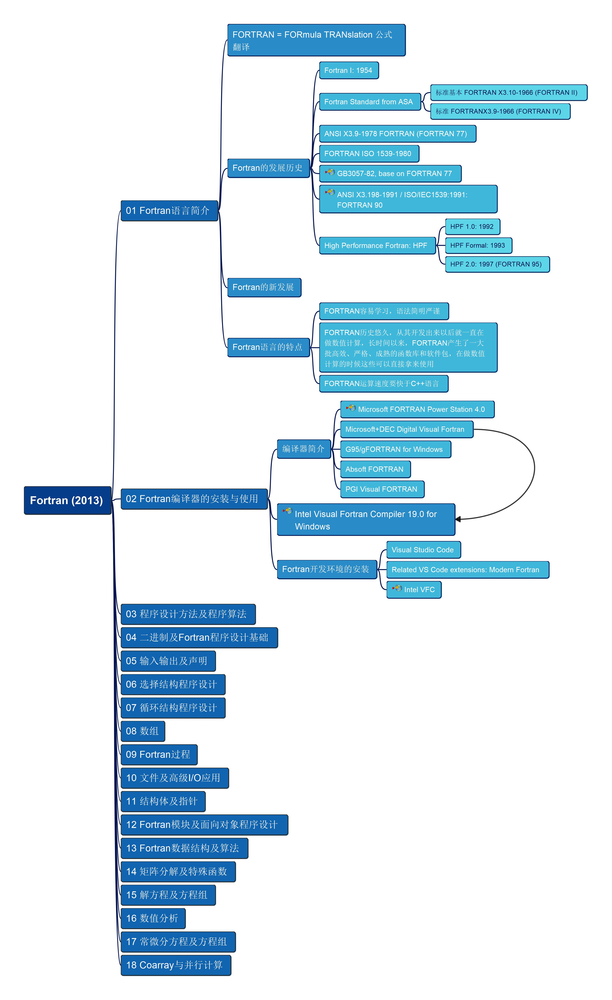

# Learn Fortran

Practice Fortran language programming

Base on the book "FORTRAN程序设计权威指南"

Mindmap of the book:

If you like my contents, feel free to sponsor me so that I'll have courage to try more, thanks!

Any questions, write me in [email](mailto:xiaoqizhao@outlook.com)