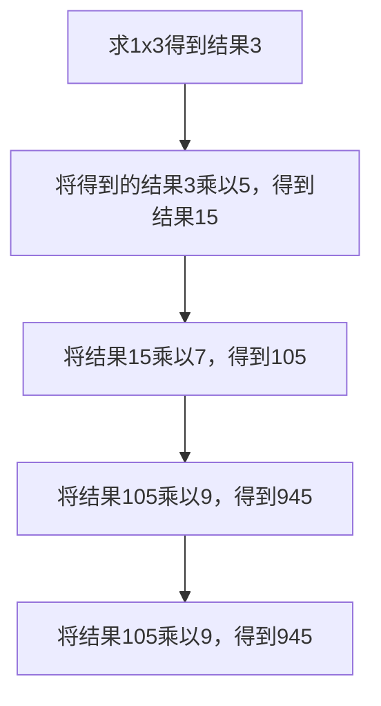

# Sample of Simple Algorithm

## Sample 3.1: 1x3x5x7x9x11

```mermaid
graph TD;
    A[求1x3得到结果3]-->B[将得到的结果3乘以5，得到结果15];
    B[将得到的结果3乘以5，得到结果15]-->C[将结果15乘以7，得到105];
    C[将结果15乘以7，得到105]-->D[将结果105乘以9，得到945];
    D[将结果105乘以9，得到945]-->E[将结果105乘以9，得到945];
    
```